# Replicate Log Analyzer — Stack Review

> FastAPI + vanilla JS desktop/web app for **Qlik Replicate** log inspection, deterministic analysis, and optional AI insights.

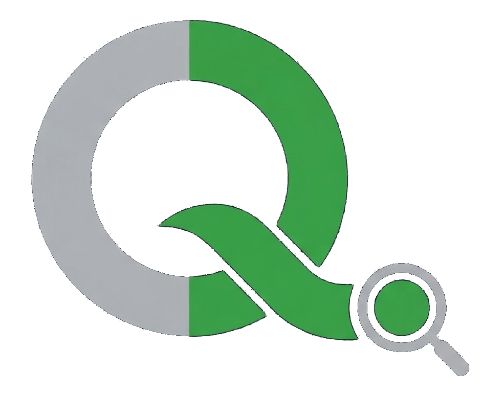

---

## 1. System at a Glance

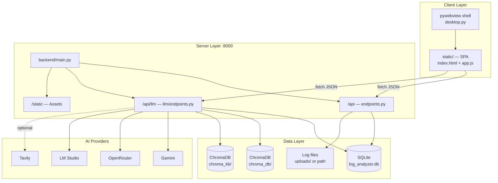

| Layer | Stack |
|-------|-------|
| **Runtime** | Python 3, Uvicorn |
| **API** | FastAPI, SQLAlchemy, Pydantic |
| **UI** | Vanilla HTML/CSS/JS, Plotly CDN |
| **Desktop** | pywebview (`desktop.py`) |
| **DB** | SQLite |
| **Vectors** | ChromaDB + `all-MiniLM-L6-v2` |
| **LLM** | Gemini · OpenRouter · LM Studio |
| **PII** | Presidio + spaCy |
| **Search** | Tavily (optional) |

**Entry points:** `backend/main.py` (server) · `desktop.py` (native app)

---

## 2. FastAPI — What It Does

**FastAPI** is the single HTTP server. It is **not** the UI framework — it serves the SPA, exposes REST APIs, and runs background work.

| Responsibility | Implementation |
|----------------|----------------|
| **App bootstrap** | `backend/main.py` — `FastAPI()`, `init_db()`, mount routers |
| **Core log API** | `backend/api/endpoints.py` → prefix `/api` |
| **AI API** | `backend/llm/endpoints.py` → prefix `/api` (routes under `/llm/...`) |
| **Static SPA** | `StaticFiles` at `/static`; `GET /` → `index.html` |
| **Async handlers** | Route handlers are `async def`; heavy CPU/IO often in sync code |
| **Background indexing** | `BackgroundTasks` → `process_log_file()` after upload/register |
| **Validation** | Pydantic models on LLM config, findings, report requests |
| **Binary responses** | `StreamingResponse` for DOCX / export downloads only |
| **Runtime** | Uvicorn `127.0.0.1:8000` |

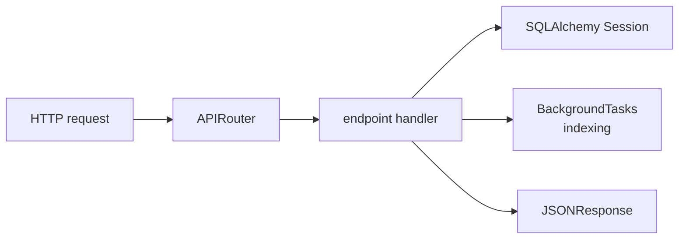

---

## 3. Frontend ↔ Backend

- **Protocol:** `fetch()` → REST/JSON. **No WebSockets.**
- **Reports:** client polls `GET /api/llm/report/{id}/progress` every ~2s.
- **Desktop:** `window.pywebview.api` for file pick/save (not HTTP).

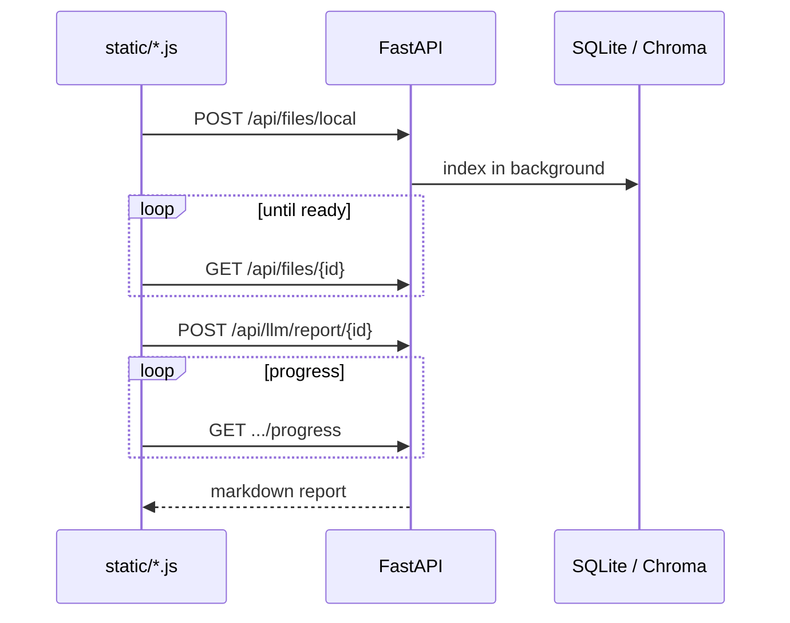

### API surface (grouped)

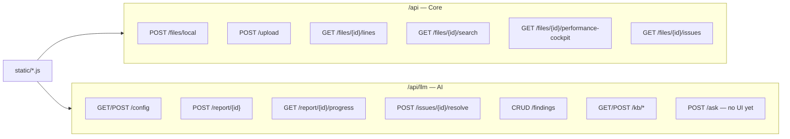

| Frontend module | Backend routes |
|-----------------|----------------|
| `app.js` | Files, lines, search, performance, issues |
| `ai-config-modal.js` | `/api/llm/config` |
| `ai-report.js` | Report generate + poll + export |
| `ai-assistant.js` | Report history, threads |
| `saved-findings.js` | Findings CRUD + export |
| `kb-sources.js` | KB sources management |

**Desktop bridge** (not HTTP):

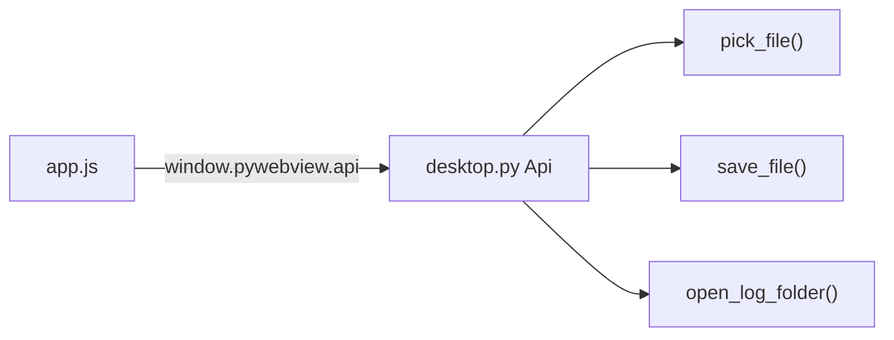

---

## 4. LLM Providers

Config lives in SQLite `llm_config` (`provider`, encrypted keys, `sanitize_log_for_cloud_llm`, etc.).

| | **Gemini** | **OpenRouter** | **LM Studio** |
|---|------------|----------------|---------------|
| **Default** | ✓ (`provider=gemini`) | Alternative cloud | Local / air-gapped |
| **Client** | `gemini_client.py` | `client.py` | `lmstudio_client.py` |
| **API** | Google AI Studio `generativelanguage.googleapis.com/v1beta` | `openrouter.ai/api/v1/chat/completions` | Native `localhost:1234/api/v1/chat` |
| **Auth** | API key in AI Settings | API key in AI Settings | None (local server) |
| **Message format** | Gemini `contents` + `systemInstruction` | OpenAI-style `messages[]` | Flat `input` string (`<instructions>` tags) |
| **Default model** | `gemini-2.5-flash` | `google/gemini-2.0-flash-exp:free` | Whatever is loaded in LM Studio |
| **Max output** | 8192 (full) / 800 (quick) | Same | 1500 default (configurable) |
| **Vision chart** | ✓ if model has vision | ✓ OpenRouter vision models | ✗ (not wired yet) |
| **Web search** | Google Search grounding | OpenRouter `plugins: [{id: "web"}]` | Tavily **MCP inside LM Studio** |
| **Sanitize logs** | Configurable | Same | **Always off** |
| **Cost** | Tracked (free tier = $0) | Per-model pricing | $0 |

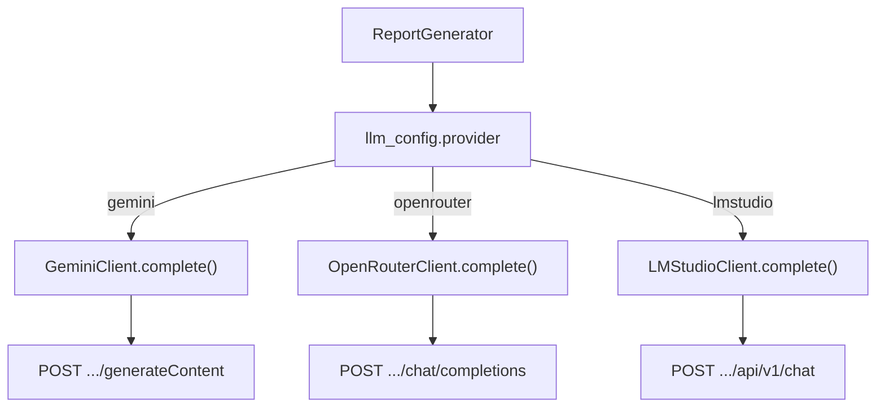

### Gemini (`gemini_client.py`)

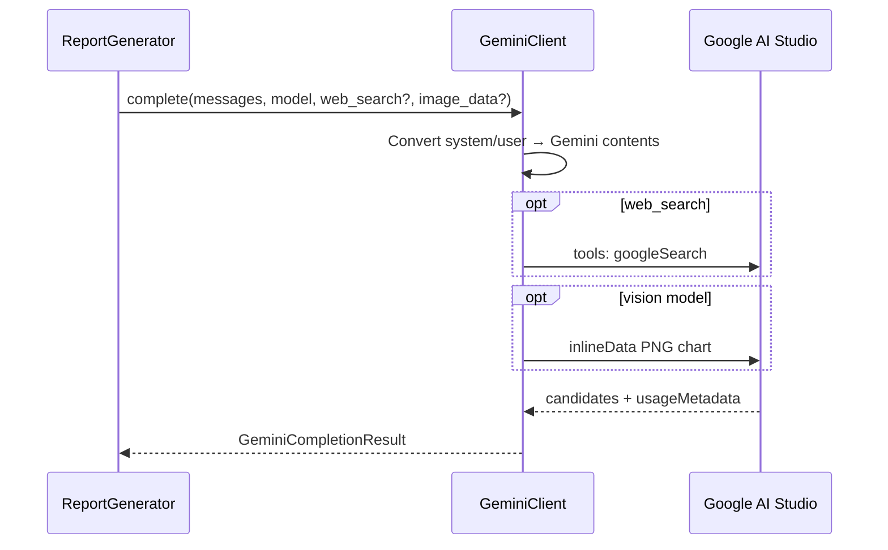

- **Endpoint:** `POST /v1beta/models/{model}:generateContent?key=...`
- **HTTP:** `httpx`, 120s timeout, cancel via `generation_cancel.py`
- **Vision:** Latency chart PNG as `inlineData` on first user message

### OpenRouter (`client.py`)

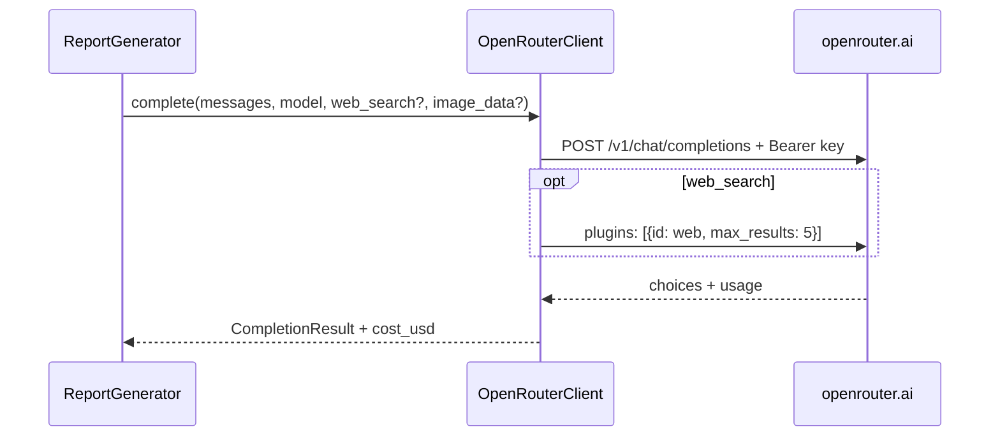

- Unified gateway — one API key → many providers
- Model list cached 1h; UI shows `RECOMMENDED_MODELS` subset
- Empty response + `web_search` → retry without web search

### LM Studio (`lmstudio_client.py`)

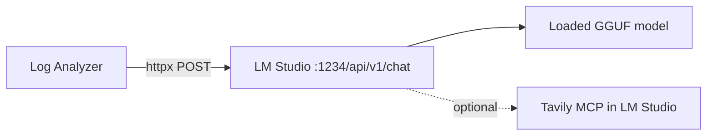

| Step | Behavior |
|------|----------|
| Configure | `lmstudio_base_url` (default `http://localhost:1234`) |
| Test | `GET /api/v1/models` — checks server + loaded models |
| Prompt | `messages[]` → single `input` with `<instructions>` wrapper |
| Context | Auto `context_length` 8K–64K from prompt size |
| Compact | Shorter prompt in `prompts.py` when `provider=lmstudio` |
| Web search | App ignores flag; LM Studio MCP handles it if configured |
| Links | Strips fabricated `[text](url)` if no `tool_call` in response |

### Optional Tavily

When `web_search_enabled` in config — used for **Gemini/OpenRouter** reports and issue resolution. **Not** injected for LM Studio (uses its own MCP).

---

## 5. PII Sanitization

### When sanitization runs

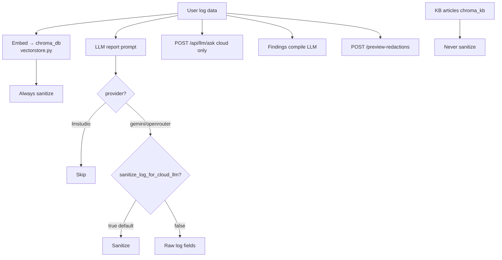

| Data | Sanitized? |
|------|------------|
| Log content for **embeddings** | ✓ Always |
| Log fields in **cloud LLM prompts** | ✓ Default (toggle in AI Settings) |
| Log fields for **LM Studio** | ✗ Never |
| **KB articles** | ✗ Never (public docs) |
| **Timestamps** | ✗ Not redacted (`DATE_TIME` excluded) |

### How it works

**Engine:** Microsoft **Presidio** + **spaCy** `en_core_web_sm` (lazy-loaded on first use).

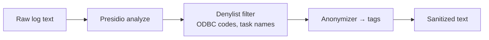

**Built-in:** IP, email, URL, phone, PERSON, NRP

**Custom recognizers:** `HOSTNAME`, `UNC_PATH`, `CONNECTION_STRING`, `CONNECTION_HOST`, `CONNECTION_PASSWORD`, `LICENSE_INFO`, `WINDOWS_PATH`, `CLOUD_RESOURCE`, `TASK_SERVER_INFO`, `REVISION_HASH`, etc.

**Replacement:** `db.prod.com` → `[HOSTNAME]`, `user@co.com` → `[EMAIL]`

**Config:** `llm_config.sanitize_log_for_cloud_llm` (default `true`)

**Module:** `backend/llm/sanitizer.py` — `sanitize_text()`, `sanitize_dict()`, `preview_redactions()`

---

## 6. AI Capabilities

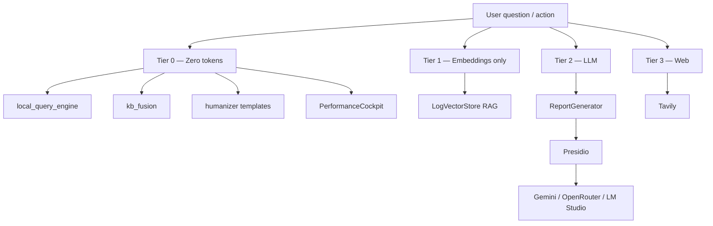

| Feature | Module | LLM? |
|---------|--------|------|
| **Insights report** | `report_generator.py` | Yes (primary) |
| **Issue resolution** | `error_resolution.py` | KB + report + optional Tavily |
| **Smart Q&A** | `POST /api/llm/ask` | Local → KB → context-only (**no UI**) |
| **Findings compile** | `findings/export` | Optional LLM email |
| **Zero-token answers** | `local_query_engine`, `kb_fusion`, `humanizer` | No |

**No agent framework** — single-shot LLM calls, no tool loops.

### Report pipeline

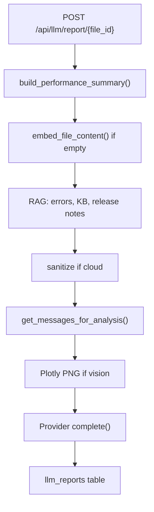

---

## 7. Key Workflows

### Load & index

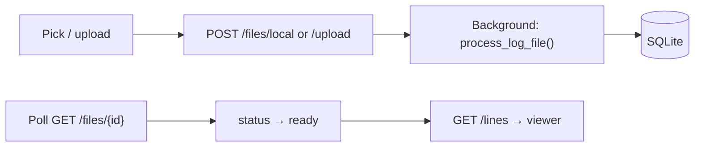

### Search & navigate

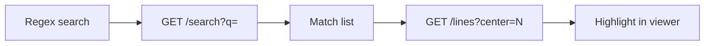

### AI report

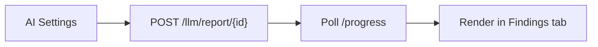

---

## 8. Data & Storage

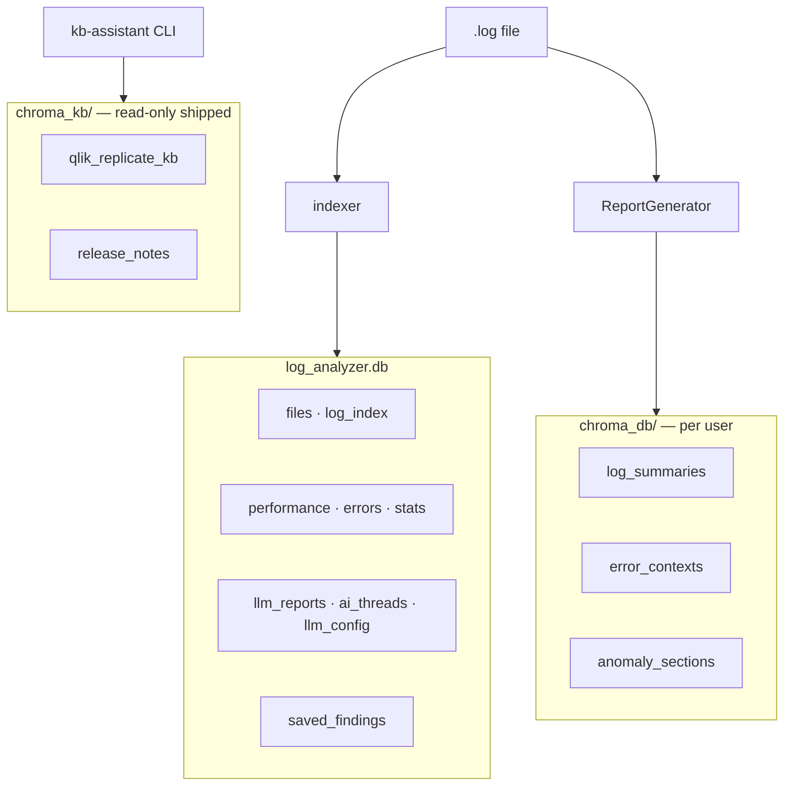

| Store | Writable | Purpose |
|-------|----------|---------|
| `log_analyzer.db` | ✓ | Index, settings, reports, findings |
| `chroma_kb/` | ✗ | Qlik KB + release notes |
| `chroma_db/` | ✓ | Per-log embeddings |
| `uploads/` | ✓ | Uploaded copies (local mode skips copy) |

---

## 9. Python Packages

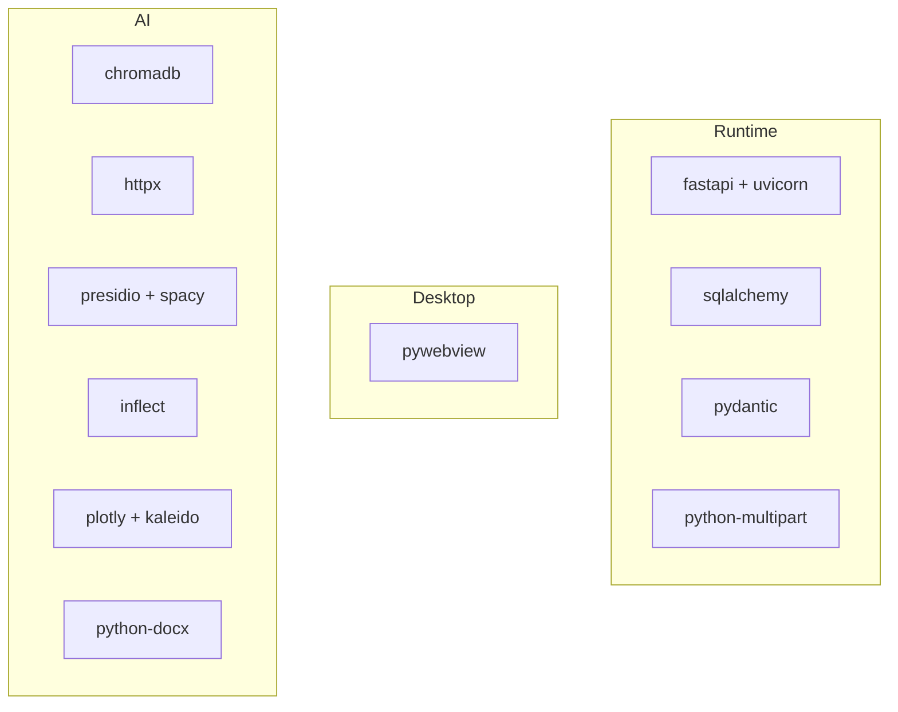

| Package | Role |
|---------|------|
| **fastapi** | HTTP API, routers, validation, static mount |
| **uvicorn** | ASGI server |
| **python-multipart** | File upload |
| **sqlalchemy** | ORM — logs, index, perf, LLM tables |
| **pydantic** | Request/response models |
| **pywebview** | Desktop shell + native dialogs |
| **chromadb** | Vector store (log + KB) |
| **httpx** | LLM provider HTTP clients |
| **presidio-analyzer / anonymizer** | PII before cloud LLM / embed |
| **spacy** | NER inside Presidio (lazy) |
| **inflect** | NL formatting in zero-LLM answers |
| **plotly + kaleido** | Latency chart PNG for vision models |
| **python-docx** | Report DOCX export |

**KB CLI** (`kb-assistant/requirements.txt`): `requests`, `beautifulsoup4`, `lxml`, `chromadb`, `rich`, `python-frontmatter`, `sqlalchemy` — build-time only.

---

## 10. Frontend — Vanilla JS, No npm

No React/Vue, no bundler, no `package.json`.

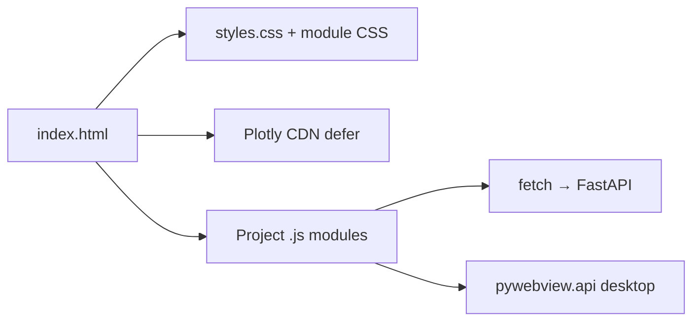

| Dependency | Type | Purpose |
|------------|------|---------|
| **Plotly 2.35.2** | CDN | Performance charts (Analysis tab) |
| **fetch API** | Built-in | All REST to `/api/...` |
| **DOM APIs** | Built-in | Viewer, tabs, infinite scroll |
| **pywebview `api`** | Desktop | `pick_file`, `save_file`, `open_log_folder` |

**Load order:** `log-colors.js` → `preset-patterns-modal.js` → `ai-config-modal.js` → `ai-report.js` → `ai-assistant.js` → `kb-sources.js` → `saved-findings.js` → `app.js`

**Not used:** React, Vue, jQuery, CodeMirror/Monaco, npm markdown libs. Syntax highlighting is custom regex in `log-colors.js`.

---

## 11. Log Reading & Big Files

**Principle:** never load the full log into RAM for viewing. Index once → read chunks from disk on demand.

### Two phases

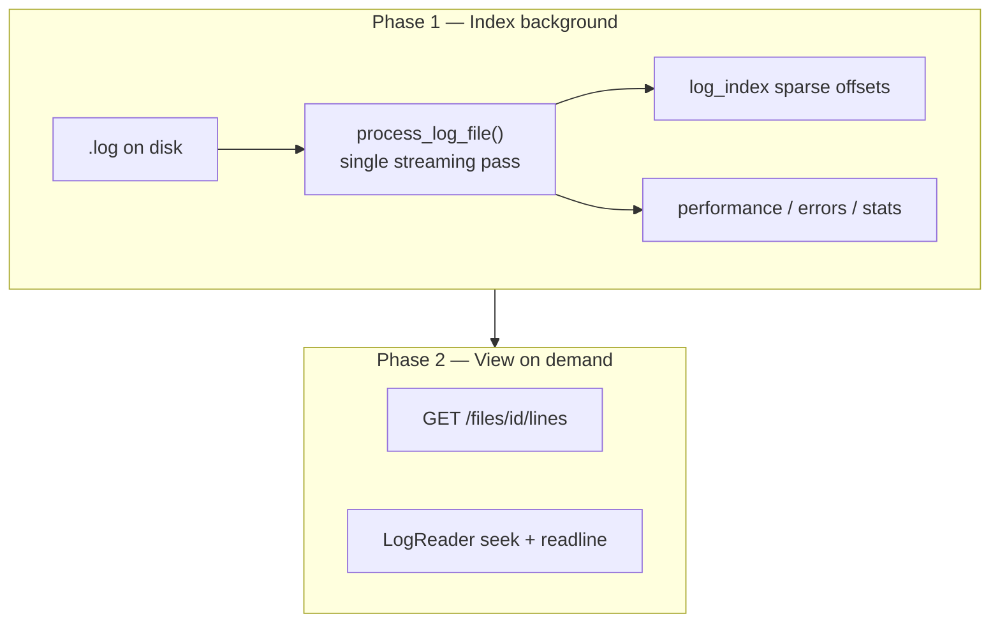

| Phase | Memory |
|-------|--------|
| **Indexing** | One line at a time + batched DB writes |
| **Reading** | ~100 lines per HTTP request |

### Sparse byte-offset index

`backend/core/indexer.py`:

| Constant | Value | Purpose |
|----------|-------|---------|
| `INDEX_INTERVAL` | 500 | Sparse `LogIndex` every N lines |
| `BATCH_SIZE` | 5000 | SQLite `bulk_save_objects` + commit |

For line **N**, `LogReader` finds largest `line_number ≤ N`, **seeks** to `byte_offset`, reads forward — at most ~500 lines of skip.

```mermaid
flowchart LR
    L["Line 12,450"] --> Q["SQL nearest index"]
    Q --> S["seek offset"]
    S --> F["readline ~500 max"]
    F --> R["return 100-line chunk"]
```

### LogReader optimizations

`backend/core/reader.py`:

| Technique | Detail |
|-----------|--------|
| **Disk seek** | `seek(byte_offset)` — O(1) jump near target |
| **Chunked API** | Default `limit=100` |
| **Centered read** | `center + before + after` for search jumps |
| **Global LRU cache** | 50 chunks `(file_id, start, limit)`; thread-safe |
| **Offset cache** | Per-reader `_index_cache` |
| **UTF-8 tolerant** | `errors="replace"` |
| **Search** | 1 MB read buffer, stop at match `limit` |
| **Reindex** | `clear_file_cache(file_id)` |

### Indexing optimizations

| Technique | Detail |
|-----------|--------|
| **Single-pass stream** | `readline()` — O(1) memory vs file size |
| **Bulk inserts** | Every 5000 lines |
| **Per-line parsing** | No whole-file multiline regex |
| **Truncated errors** | Max 500 chars in DB |
| **Local-file mode** | `POST /files/local` — no copy |
| **Background** | API returns `indexing`; UI polls |

### Frontend windowing

`static/app.js`:

```mermaid
sequenceDiagram
    participant U as User scroll
    participant UI as app.js
    participant API as GET /lines

    U->>UI: scroll bottom
    UI->>API: start=loadedEnd, limit=100
    API-->>UI: append DOM

    U->>UI: scroll top
    UI->>API: prepend chunk

    U->>UI: search match click
    UI->>API: center=N, before=50, after=50
```

| Behavior | Detail |
|----------|--------|
| Chunk size | 100 lines |
| Bidirectional scroll | DOM only for loaded range |
| RAF-throttled scroll | Avoids fetch storms |
| Deduped fetches | `lastFetchStart` / direction guard |

**Result:** Multi-GB logs stay on disk; browser holds ~100–200 lines of DOM.

### Precomputed vs on-demand

| Data | When |
|------|------|
| Index, perf, errors, stats | Index pass |
| Performance cockpit, bulk map | On API request |
| Chroma embeddings | First AI report |

### Log I/O API

| Endpoint | Method | Use |
|----------|--------|-----|
| `GET /files/{id}/lines?start=&limit=` | `read_lines()` | Scroll / load |
| `GET /files/{id}/lines?center=&before=&after=` | `read_lines_centered()` | Jump to line |
| `GET /files/{id}/search?q=` | `search()` | Regex find |
| `POST /files/local` | — | Register path, index |
| `POST /upload` | — | Copy + index |
| `POST /files/{id}/reindex` | — | Refresh index |

---

## 12. UI Structure

```mermaid
flowchart TB
    subgraph Tabs["Main tabs"]
        LV["Log View"]
        AN["Analysis"]
        RS["Resources"]
        FN["Findings"]
    end

    subgraph Left["Left panel"]
        OF["Open File"]
        SR["Search"]
        TC["Threads & Components"]
        QI["Quick Insights"]
    end

    LV --- Left
    FN --> AIR["ai-report.js"]
    QI --> AIA["ai-assistant.js"]
```

---

## 13. Project Layout

```mermaid
mindmap
  root((log_analyzer))
    backend
      api/endpoints.py
      core/indexer reader analysis
      llm/report_generator vectorstore
    static
      app.js ai-report.js
    kb-assistant
      offline KB indexer
    chroma_kb
      shipped vectors
    chroma_db
      per-log vectors
```

---

## 14. Distribution

```mermaid
flowchart LR
    DEV["python desktop.py"] --> UV["Uvicorn :8000"]
    PKG["PyInstaller"] --> APPDATA["%LOCALAPPDATA%/ReplicateLogAnalyzer/"]
    APPDATA --> DB2["log_analyzer.db + chroma_db"]
    PKG --> CKB3["chroma_kb bundled"]
```

---

## 15. Key Files

| Area | Path |
|------|------|
| Server boot | `backend/main.py` |
| Core API | `backend/api/endpoints.py` |
| Indexer | `backend/core/indexer.py` |
| Log reader | `backend/core/reader.py` |
| Analysis | `backend/core/analysis.py` |
| AI routes | `backend/llm/endpoints.py` |
| Report engine | `backend/llm/report_generator.py` |
| Prompts | `backend/llm/prompts.py` |
| PII | `backend/llm/sanitizer.py` |
| Vectors | `backend/llm/vectorstore.py` |
| Gemini / OR / LM Studio | `gemini_client.py`, `client.py`, `lmstudio_client.py` |
| Main UI | `static/app.js` |
| KB CLI | `kb-assistant/kb_loader.py` |

---

*Stack review — May 2026*
